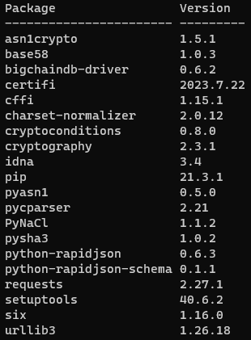

# BigchainDB

## BigchainDB python-driver のインストール環境
python-version = 3.6.8  
pip = 21.3.1  
setuptools = 40.6.2  
`pip list`で確認

Visual Studio Build Tools 2019  
追加でチェックを入れるところ(デフォルトで入ってるものはそのまま)
* C++ BuildTools(C++によるデスクトップ開発)
* MSVC v140 - VS2015C++ビルドツール(v14.00)

pipのアップデート  
`python -m pip install --upgrade pip`  
setuptoolsのアップデート  
`pip install --upgrade setuptools`  

Ubuntuでの作業
```text
$ sudo apt-get update
$ sudo apt-get install python3-dev libssl-dev libffi-dev
```

python-driverのインストール  
`pip install bigchaindb_driver`

環境構築後のpipパッケージ
